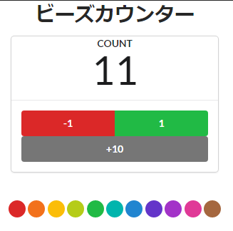

# react-redux-counter



下記サンプルソースを元に一部修正しました

https://github.com/oukayuka/Riakuto-StartingReact-ja3.1/tree/master/11-redux/05-use-reducer


* 修正点
  * containerコンポーネントとpresentationalコンポーネントを一つにまとめる

* 特徴
  * `useReducer(`)を利用することで、stateをReduxと同じ仕組みで管理できる
  * 親コンポーネントからstateとactionを子コンポーネントに渡す必要がある

    ⇒ このサンプルだと、普通にprop drillingと変わらない気がする
  * 別途`useContex()`を使い、子コンポーネントとstateとactionを共有すればいい

---
src/features/counter.ts

* redux toolkitを利用することで、驚くほどreducerが書きやすくなります。

createSlice()を利用すれば、Actionの定義と、reducerの値変更を一緒に行うことができます。

```typescript
import React, { VFC, useReducer } from 'react';
import { createSlice, PayloadAction } from '@reduxjs/toolkit';

import ColorfulBeads from './ColorfulBeads';
import CounterBoard from './CounterBoard';

type CounterState = { count: number };
const initialState: CounterState = { count: 0 }; // dummy

const counterSlice = createSlice({
  name: 'counter',
  initialState,
  reducers: {
    added: (state, action: PayloadAction<number>) => ({
      ...state,
      count: state.count + action.payload,
    }),
    decremented: (state) => ({ ...state, count: state.count - 1 }),
    incremented: (state) => ({ ...state, count: state.count + 1 }),
  },
});

const CounterWidget: VFC<{ initialCount?: number }> = ({ initialCount = 0 }) => {
  const [state, dispatch] = useReducer(
    counterSlice.reducer,
    initialCount,
    (count: number): CounterState => ({ count }),
  );

  const { added, decremented, incremented } = counterSlice.actions;
  const { count } = state;

  return (
    <>
      <CounterBoard
        {...{
          count,
          add: (amount: number) => dispatch(added(amount)),
          decrement: () => dispatch(decremented),
          increment: () => dispatch(incremented),
        }}
      />
      <ColorfulBeads count={count} />
    </>
  );
};

export default CounterWidget;

```


